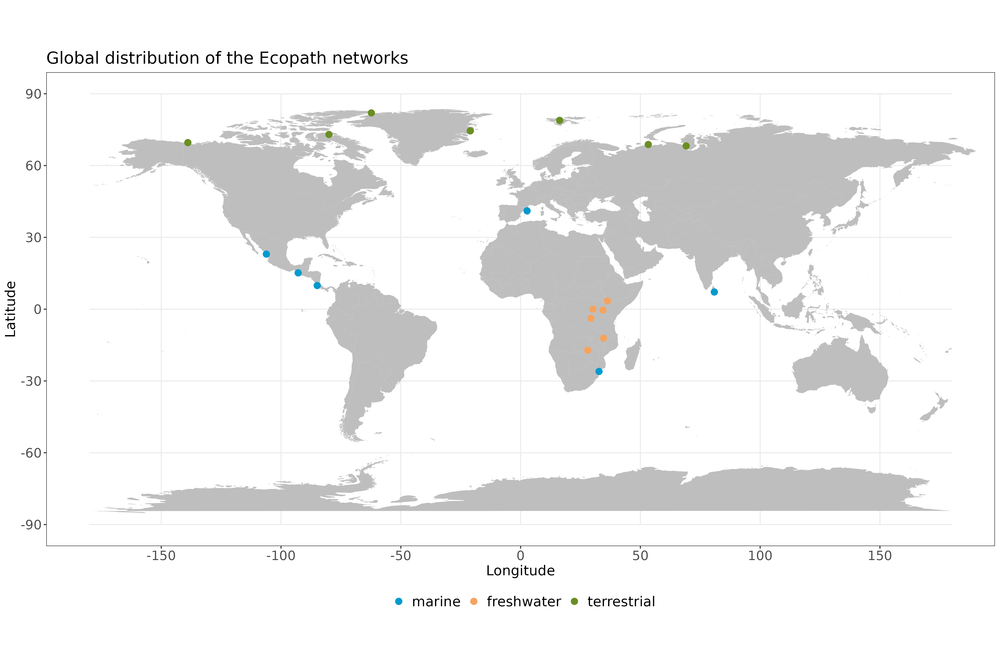

# Introduction

- prey predator relations

- allometry

The space clearance rate, as defined by [@DeLong2021PreEco], is a parameter involved in the action of predation. Following its name, the units of the parameter are of area cleared (km²) per individual per unit of time (year). 

We know that the maximum speed of an organism scales with its bodymass [@Hirt2017GenSca]. Therefore, we assume that the space clearance rate of a organism scales with its maximum speed. In this study we found that the space clearance rate of an organism scales with its bodymass.

- See [@Brown2003EcoFoo] for rate of interaction depends on the rate of metabolism which depends on body size and temperature. He also said that rate of interspecific interaction can be predicted by the metabolic theory, because rate of consumption and growth are determined by individual metabolic rates and have the same dependencies on body sizes and temperature.
 
- Paper de Gibert ou Gilbert?
- Check model Loreau
- Brose 2010 pour v ~ M

# Method description

## The data

We searched the litterature for quantitative trophic networks where, as the opposite of qualitative trophic networks (presence or absence of interaction), the flow of biomass from preys to predators were present. By their very nature, networks of interaction are hard to empricially sample [@Jordano2016ChaEco], even more if they are quantitative. Consequently, there are not many, if at all, quantitative trophic networks openly available to work with. Thus, we had to rely on quantitative networks resulting from models, specifically Ecopath with Ecosim (EwE). Ecopath is a modelling softwaire that relies on a mass-balance premiss giving us a static image of the flows of biomass between preys and predators in an ecosystem [@Christensen2005EcoEco]. Therefore, with each network was avaiable the flux of biomass between every organism and their respective biomass in each trophic network. We were able to curate 19 Ecopath with Ecosim (EwE) networks to do our analysis (detailed list in appendix A).

{#fig:map}

These 19 networks (@fig:map) span over different kind of ecosystems (e.g. marine, freshwater and terrestrial) with many different taxas and trophic guilds (e.g. mammal carnivores, mammal herbivores, birds, pelagic and demersal carnivorous fish, pelagic and demersal herbivorous fish, invertebrates, etc.). It is not uncommon for the nodes in Ecopath networks to represent functional groups and not a specific species. Thus, the 19 Ecopath networks were chosen based on taxonomic resolution of the species involved. This decision was made to ensure we could retrieve a decent estimate of organisms mean bodymass. Still, from those 19 networks some contain functional groups but the species involved in those nodes were well defined and pretty similar to eachother, which made it easy to retrieve a mean bodymass for these groups. It resulted in a list of 1380 pairwise trophic interactions between predators and preys.

Ecopath networks come with their advantage and disadvantage. The biggest advantage is that each network are built within the same framework giving us a robust base to rely on.

## The analysis

We first made a correspondance between the species names in the networks with their corresponding names in their respective original article to make sure we were working with the right species. We then proceeded to resolve the taxonomy to work with up to date names. This allowed us to retrieve mean body mass for each species present in our dataset. Given the diversity of taxa present in the dataset, these species traits had to be recovered from different databases. The mean bodymass for marine and aquatic species were retrieve from Fishbase with length-weight relationship, while mean bodymass for terrestrial species came from different sources such as the GATEWAy database [@Brose2018GloDat] their original article and grey litterature. With these mean bodymass in hand for each species of the dataset, we computed an estimate of species abundance ($N$) by dividing species biomass ($B$) by their mean bodymass ($M$):

$$ N = \frac{B}{M} $$

The analysis were performed in a Bayesian framework with stan version 2.21.0 via the package rstan in R version 4.2.2. We proceeded to fit the models to the data and parametrized  each of the parameters per model respectively. We then made predictions on the data with the parametrized models and followed with a ranking  using a leave-one-out method adapted to our Bayesian framework. We also computed the bayesian R² [@Gelman2019RsqBay] for each model.

| Model name | Model equation | Description |
|:---:|:---:|:---:|
| Null model | $F_{ij} = K$ | The first model acts as a null model, where we hypothesize that the flux of biomass between a prey $i$ and its predator $j$ (F_{ij}) can be explained by a constant ($K$) which is a parameter. |
| General mass-action | $F_{ij} = \alpha \times B_i \times N_j$ | The second model suggests that the flux of  biomass between a prey $i$ and its predator $j$  can be explained by a general mass action processus  which depends on the abundance of the predator ($N_j$),  the available biomass of the prey ($B_i$) and a general  space clearance rate as parameter ($\alpha$). |
| Predator-specific mass-action | $F_{ij} = \alpha_{j} \times B_i \times N_j$ | The third model suggests that the flux of  biomass between a prey $i$ and its predator  $j$ still can be explained by a mass action  processus which depends on the abundance of the predator  ($N_j$), the available biomass of the prey  ($B_i$) but with predator-specific space  clearance rate parameters ($\alpha$). |
| Saturated mass-action with handling time | $F_{ij} = \displaystyle\frac{\alpha_j \times B_i \times N_j}{1 + h_j \times \alpha_j \times sumB \times N_j}$ | The fourth model hypothesize that the flux of  biomass between a prey $i$ and its predator  $j$ is explained by a predator-specific  space clearance rate and an effect of saturation  with the handling time of the predator ($h_j$)  both as parameter and the total amount of biomass  available of all the preys of the predator $j$  ($sumB$). |

# References
